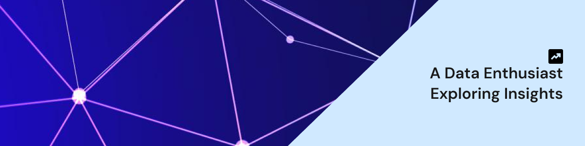

 
 ### Hello, World! 🌍

I'm Subhanu.A full stack data scientist with a passion to build end to end solutions by combining data, engineering and design.  
You'd find me mostly tinkering with data, plots and and models. Often at milking datasets dry for insights. I also dabbble in software development and design whenever I hit a stroke of inspiration ( or when I feel like avoiding work with messy data for a while 😏 )

---
<h3 align="left">Tools and Technologies</h3>

    
  
  
  <a href="https://scikit-learn.org/" target="_blank" rel="noreferrer"> 
    
    
       
       
   
    
     
    
    
    
    
    
    
    
    
     
   

      

---
### Projects ⚒️

See all my projects here ➡️ <a href="https://github.com/subhanu-dev?tab=repositories
" target="_blank">Project Repos</a>  

---
### 🌐 Connect with me

Portfolio Site:    <a href="https://www.subhanu.live/" target="_blank">www.subhanu.live</a>  
LinkedIn:          <a href="https://linkedin.com/in/subhanuchamaka" target="_blank">subhanuchamaka</a>  
Email:             <a href="mailto:subhanuliyanage@gmail.com" target="_blank">Subhanuliyanage@gmail.com</a>

  

